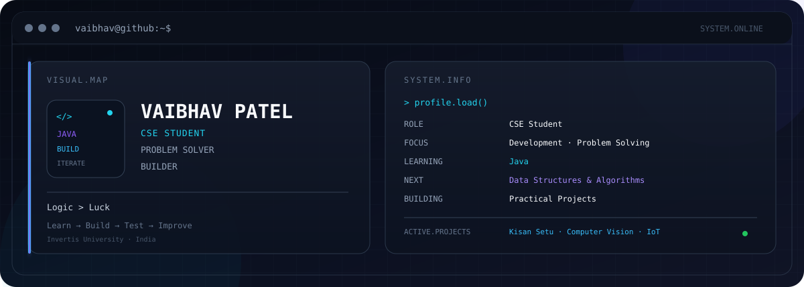

<picture>
  <source media="(prefers-color-scheme: dark)" srcset="./dark.svg">
  <source media="(prefers-color-scheme: light)" srcset="./light.svg">
  
</picture>

# VAIBHAV PATEL

### `CSE STUDENT` · `PROBLEM SOLVER` · `BUILDER`

> Building practical projects while strengthening the fundamentals that make good software possible.

I'm a **B.Tech CSE student at Invertis University**, interested in turning ideas into practical, working solutions.

My projects have taken me across **web development, Python, computer vision, AI concepts, IoT and automation**. Right now, I'm keeping my learning focused: **Java first, DSA next**, and stronger projects along the way.

---

## `SYSTEM.INFO`

```text
┌──────────────────────────────────────────────────────────────┐
│                                                              │
│  NAME        Vaibhav Patel                                  │
│  ROLE        CSE Student                                    │
│  LOCATION    India                                          │
│                                                              │
│  FOCUS       Problem Solving · Development · Projects       │
│                                                              │
│  LEARNING    Java                                           │
│  NEXT        Data Structures & Algorithms                   │
│                                                              │
│  BUILDING    Practical Software + Hardware Projects         │
│                                                              │
└──────────────────────────────────────────────────────────────┘
```

---

## `ABOUT.ME`

🎓 **B.Tech CSE Student** at Invertis University  
🌐 **HTML & CSS** fundamentals completed  
☕ **Java** — currently learning  
🧠 **DSA** — next on the roadmap  
🤖 Exploring **AI, computer vision & automation** through projects  
⚡ Interested in **IoT, web development & practical problem solving**  
🛠️ Learning by building, testing and improving

I don't want to learn everything at once.

My current approach is simple:

**Understand → Build → Break → Fix → Improve**

---

## `CURRENT.FOCUS`

```text
JAVA
  │
  ├── Programming Fundamentals
  │
  ├── Object-Oriented Programming
  │
  ├── Problem Solving
  │
  ▼
DATA STRUCTURES & ALGORITHMS
  │
  ▼
STRONGER DEVELOPMENT PROJECTS
```

Currently, my priority is to build a solid programming foundation with **Java** before moving into **DSA**.

---

## `FEATURED.PROJECTS`

### 🌾 KISAN SETU 3.0

A digital agricultural marketplace concept designed to connect **farmers and buyers directly**, with a focus on more transparent agricultural trade.

`Web Development` `Agriculture` `AI Concepts`

**Repository →** [Kisan-setu-3.0](https://github.com/vaibhavgangwar081-ops/Kisan-setu-3.0)

---

### 🚐 AI AUTONOMOUS CAMPUS SHUTTLE

A smart campus transportation concept built around an autonomous shuttle experience, campus-specific stops and a monitoring dashboard.

`AI Concepts` `Smart Mobility` `Campus Automation`

---

### 📵 NO PHONE ZONE

A computer-vision project designed to detect phone usage through a camera and trigger an automated response.

`Python` `OpenCV` `YOLO` `Computer Vision`

---

### ⚡ VOLTPRECISION

A smart hostel energy-monitoring dashboard designed to visualize electricity usage and help identify abnormal consumption.

`HTML` `CSS` `JavaScript` `Firebase` `IoT`

---

### 🤖 ESP32 EMOTION BOT

An ESP32-based interactive project using an OLED display to represent different emotional states and respond to interaction.

`ESP32` `OLED` `IoT` `Embedded Systems`

---

### 📚 INVERTIS PREP

A student-focused platform concept for organizing and accessing **Invertis University previous-year question papers**.

`HTML` `CSS` `Web Development`

---

## `TECH.STACK`

### `LANGUAGES`

`C` `Java` `Python`

### `WEB`

`HTML` `CSS` `JavaScript`

### `AI / COMPUTER VISION`

`Python` `OpenCV` `YOLO`

### `BACKEND / SERVICES`

`Flask` `Firebase`

### `TOOLS`

`Git` `GitHub`

### `IOT / EMBEDDED`

`ESP32` `Wokwi` `OLED`

---

## `LEARNING.ROADMAP`

| Stage | Focus | Status |
|:---:|---|:---:|
| `01` | HTML | ✓ Completed |
| `02` | CSS | ✓ Completed |
| `03` | Java | ⏳ Currently Learning |
| `04` | DSA | → Next |
| `05` | Advanced Projects | → Building Towards |

---

## `HOW.I.BUILD`

```text
        ┌──────────────┐
        │     IDEA     │
        └──────┬───────┘
               ↓
        ┌──────────────┐
        │ UNDERSTAND   │
        │ THE PROBLEM  │
        └──────┬───────┘
               ↓
        ┌──────────────┐
        │    DESIGN    │
        └──────┬───────┘
               ↓
        ┌──────────────┐
        │    BUILD     │
        └──────┬───────┘
               ↓
        ┌──────────────┐
        │     TEST     │
        └──────┬───────┘
               ↓
        ┌──────────────┐
        │   IMPROVE    │
        └──────────────┘
```

I prefer learning through **building and experimentation**—taking an idea, turning it into something functional, finding what breaks and improving it.

---

## `CURRENTLY.BUILDING`

```text
┌─ JAVA
│  └─ Strengthening programming fundamentals
│
├─ PROBLEM SOLVING
│  └─ Improving logical thinking through programming
│
├─ DSA
│  └─ Next major learning milestone
│
└─ PROJECTS
   └─ Turning ideas into practical implementations
```

---

## `PROJECT.MINDSET`

```text
        CURIOUS
           │
           ▼
        EXPLORE
           │
           ▼
         BUILD
           │
           ▼
         TEST
           │
           ▼
        IMPROVE
           │
           ▼
         REPEAT
```

> **Logic > Luck**

---

## `GITHUB.ACTIVITY`

I use GitHub to **build, experiment, document projects and track my progress** as I continue developing my programming skills.

---

## `CONNECT`

**LinkedIn** → [vaibhav-patel-2612053b](https://www.linkedin.com/in/vaibhav-patel-2612053b/)

**GitHub** → [vaibhavgangwar081-ops](https://github.com/vaibhavgangwar081-ops)

---

### `BUILDING SKILLS. BUILDING PROJECTS. BUILDING FORWARD.`

*One concept. One project. One step at a time.*
